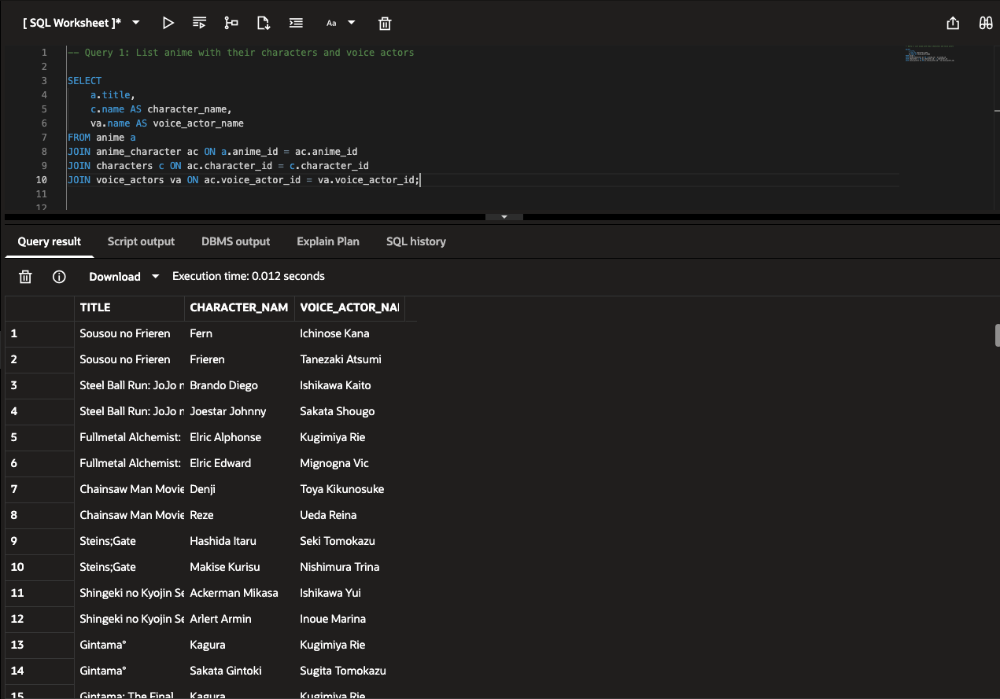
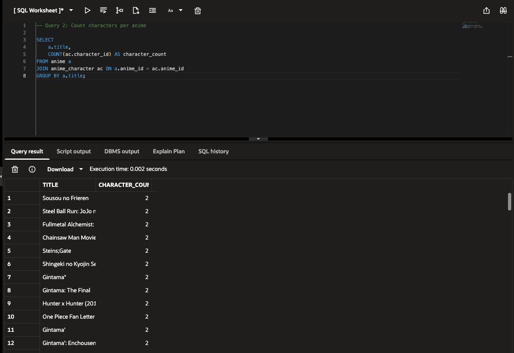
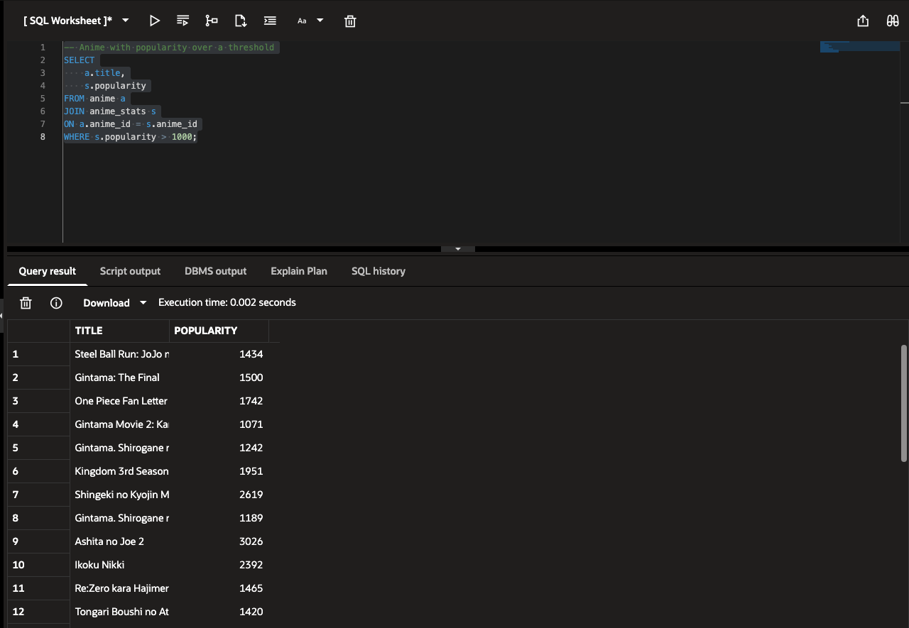
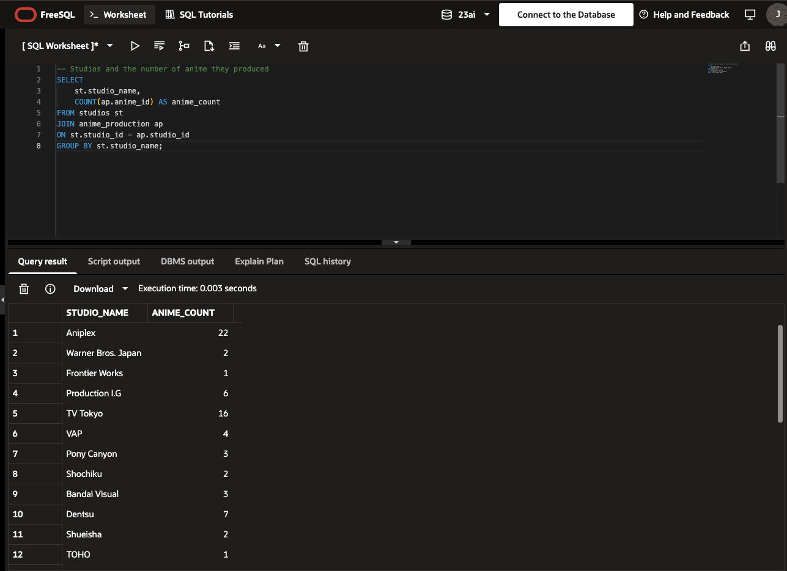

# Anime Database Project

## Overview

Designed and implemented a normalized relational database for managing anime titles, characters, voice actors, studios, genres, and popularity statistics. This project demonstrates database design, entity relationship modeling, SQL querying, aggregations, filtering, and many-to-many relationships.

## Skills Demonstrated

- Database Design
- Entity Relationship Diagrams (ERDs)
- Database Normalization
- SQL Joins
- Aggregations
- Filtering and Grouping
- Many-to-Many Relationships
- Relational Database Modeling

## Database Entities

- Anime
- Characters
- Voice Actors
- Studios
- Genres
- Anime Production
- Anime Stats

## Project Files

- `queries.sql` – SQL queries used throughout the project
- `Anime_ERD.pdf` – Entity Relationship Diagram
- `Anime_Database_Project_Presentation.pdf` – Full project documentation and presentation

---

## Entity Relationship Diagram

See:

- `Anime_ERD.pdf`

---

## Example Queries and Results

### Query 1: List Anime with Characters and Voice Actors

```sql
SELECT
    a.title,
    c.name AS character_name,
    va.name AS voice_actor_name
FROM anime a
JOIN anime_character ac ON a.anime_id = ac.anime_id
JOIN characters c ON ac.character_id = c.character_id
JOIN voice_actors va ON ac.voice_actor_id = va.voice_actor_id;
```

**Query Result**



---

### Query 2: Count Characters per Anime

```sql
SELECT
    a.title,
    COUNT(ac.character_id) AS character_count
FROM anime a
JOIN anime_character ac ON a.anime_id = ac.anime_id
GROUP BY a.title;
```

**Query Result**



---

### Query 3: Filter Anime by Popularity

```sql
SELECT
    a.title,
    s.popularity
FROM anime a
JOIN anime_stats s
ON a.anime_id = s.anime_id
WHERE s.popularity > 1000;
```

**Query Result**



---

### Query 4: Count Anime by Studio

```sql
SELECT
    st.studio_name,
    COUNT(ap.anime_id) AS anime_count
FROM studios st
JOIN anime_production ap
ON st.studio_id = ap.studio_id
GROUP BY st.studio_name;
```

**Query Result**



---

## Key Takeaways

This project demonstrates the ability to:

- Design normalized relational database schemas
- Create and interpret Entity Relationship Diagrams
- Model many-to-many relationships using junction tables
- Write SQL joins across multiple tables
- Use filtering, grouping, and aggregation functions
- Organize and query structured data efficiently